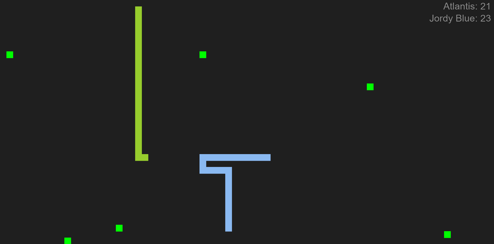

# Snake

*Created in 2017* 
2 player version of the well known classic game [Snake](https://en.wikipedia.org/wiki/Snake_(video_game_genre)). 
Written in `javascript` and `html`. 
Using the [p5.js](https://p5js.org/) library for the game objects and the game rendering.

# How to run
You can run this game by opening the [index.html](./index.html) in your browser or you can run a simple http server in the root folder of this repo e.g. (in python) `python -m http.server`

# Controls
`arrow keys` navigate your snake through the field. 
`f` toggle full screen. 
`p` pause the game. 